# Descrição do Projeto – Quadro Kanban


Este projeto visa o desenvolvimento de um sistema de gerenciamento de tarefas baseado no modelo **Kanban**. O sistema será acessado por diferentes tipos de usuários, como **administrador**, **líder**, **membro**, **convidado** e **visitante**, cada um com permissões específicas.


Entre os principais **requisitos funcionais** estão funcionalidades como:


-   Cadastro, login e recuperação de senha de usuários;
  
-   Criação e gerenciamento de organizações, grupos e quadros Kanban;
  
-   Controle de tarefas com atribuições, prazos, comentários e status;
  
-   Compartilhamento de quadros com permissões personalizadas;
  
-   Integrações com serviços externos, como Google Calendar.
  


O sistema também contempla **requisitos não funcionais**, como:


-   Disponibilidade 24/7;
  
-   Interface responsiva para todos os dispositivos;
  
-   Segurança de dados;
  
-   Capacidade de escalar para grandes equipes.
  


Com base nesses requisitos, também foram definidos diversos **casos de uso** que representam as interações esperadas dos usuários com o sistema.


* **Atores do projeto**


   * Administrador
   * líder
   * Membro
   * Convidado
   * Visitante


* **Requisitos funcionais:**


| \[RF01\] | Cadastrar usuário |
| -- | -- |
| **Descrição** | O usuário poderá preencher um formulário com nome, e-mail, senha e outras informações, e ao enviar o formulário será criado um novo cadastro no sistema. |
| **Prioridade** | Essencial |
| **Caso de uso relacionado** | \[UC01\] |


| **\[RF02\]** | **Logar usuário** |
|--|--|
| **Descrição** | O usuário poderá acessar o sistema inserindo e-mail ou username e senha ou com sua conta google, sendo redirecionado à tela inicial após autenticação válida. |
| **Prioridade** | Essencial |
| **Caso de uso relacionado** | \[UC02\] |


| **\[RF03\]** | **Recuperar senha** |
|--|--|
| **Descrição** | O sistema enviará um link de redefinição de senha ao e-mail do usuário mediante solicitação na tela de login. |
| **Prioridade** | Essencial |
| **Caso de uso relacionado** | \[UC03\] |


| **\[RF04\]** | **Deletar usuário** |
|--|--|
| **Descrição** | Permite que um usuário seja removido do sistema por um administrador ou pelo próprio dono da conta. |
| **Prioridade** | Alta |
| **Caso de uso relacionado** | \[UC04\] |


| **\[RF05\]** | **Apagar conta** |
|--|--|
| **Descrição** | O usuário poderá excluir permanentemente sua conta e todos os dados relacionados. |
| **Prioridade** | Essencial |
| **Caso de uso relacionado** | \[UC05\] |


| **\[RF06\]** | **Criar organização** |
|--|--|
| **Descrição** | Permite ao usuário criar uma nova organização com nome, descrição, quadros, grupos e membros associados. |
| **Prioridade** | Essencial |
| **Caso de uso relacionado** | \[UC06\] |


| **\[RF07\]** | **Deletar organização** |
|--|--|
| **Descrição** | Um administrador poderá remover uma organização e todos os dados associados, como quadros e grupos. |
| **Prioridade** | Alta |
| **Caso de uso relacionado** | \[UC07\] |


| **\[RF08\]** | **Criar grupo de trabalho** |
|--|--|
| **Descrição** | Usuários podem criar grupos dentro de organizações para dividir tarefas e quadros Kanban. |
| **Prioridade** | Essencial |
| **Caso de uso relacionado** | \[UC08\] |


| **\[RF09\]** | **Deletar grupo de trabalho** |
|--|--|
| **Descrição** | O sistema permitirá a exclusão de grupos de trabalho e seus dados por membros com permissão. |
| **Prioridade** | Alta |
| **Caso de uso relacionado** | \[UC09\] |


| **\[RF10\]** | **Criar Quadro Kanban** |
|--|--|
| **Descrição** | O usuário poderá criar quadros Kanban com colunas e personalizações para organizar tarefas. |
| **Prioridade** | Essencial |
| **Caso de uso relacionado** | \[UC10\] |


| **\[RF11\]** | **Editar Quadro Kanban** |
|--|--|
| **Descrição** | Os usuários com permissão poderão editar o nome, colunas e outras propriedades do quadro Kanban. |
| **Prioridade** | Essencial |
| **Caso de uso relacionado** | \[UC11\] |


| **\[RF12\]** | **Deletar Quadro Kanban** |
|--|--|
| **Descrição** | Um usuário com permissão poderá apagar quadros, excluindo todas as tarefas contidas nele. |
| **Prioridade** | Alta |
| **Caso de uso relacionado** | \[UC12\] |


| **\[RF13\]** | **Compartilhar acesso a um recurso** |
|--|--|
| **Descrição** | Usuários poderão compartilhar quadros com membros específicos da organização, concedendo permissões conforme necessário. |
| **Prioridade** | Essencial |
| **Caso de uso relacionado** | \[UC13\] |


| **\[RF14\]** | **Controle de permissões em recursos compartilhados** |
|--|--|
| **Descrição** | O administrador ou líder do recurso poderá definir permissões de leitura, escrita ou definir um papel para cada membro que tiver acesso. |
| **Prioridade** | Essencial |
| **Caso de uso relacionado** | \[UC14\] |


| **\[RF15\]** | **Compartilhar recurso com link público** |
|--|--|
| **Descrição** | Permite gerar um link público para visualização ou edição, com níveis de acesso predefinidos pelo administrador ou líder. |
| **Prioridade** | Alta |
| **Caso de uso relacionado** | \[UC15\] |


| **\[RF16\]** | **Modo somente leitura para visitantes** |
|--|--|
| **Descrição** | Convidados poderão acessar o recurso em modo somente leitura, sem a possibilidade de editar o conteúdo. |
| **Prioridade** | Normal |
| **Caso de uso relacionado** | \[UC16\] |


| **\[RF17\]** | **Criar tarefa** |
|--|--|
| **Descrição** | Os usuários poderão adicionar novas tarefas dentro de colunas específicas dos quadros Kanban. |
| **Prioridade** | Essencial |
| **Caso de uso relacionado** | \[UC17\] |


| **\[RF18\]** | **Editar tarefa** |
|--|--|
| **Descrição** | Permite modificar informações como título, descrição, data, responsável e status das tarefas. |
| **Prioridade** | Essencial |
| **Caso de uso relacionado** | \[UC18\] |


| **\[RF19\]** | **Deletar tarefa** |
|--|--|
| **Descrição** | O sistema permitirá excluir tarefas individualmente, removendo-as de seu respectivo quadro. |
| **Prioridade** | Alta |
| **Caso de uso relacionado** | \[UC19\] |


| **\[RF20\]** | **Cancelar tarefa** |
|--|--|
| **Descrição** | As tarefas poderão ser marcadas como canceladas, mantendo seu histórico para consulta futura. |
| **Prioridade** | Alta |
| **Caso de uso relacionado** | \[UC20\] |


| **\[RF21\]** | **Bloquear/desbloquear tarefa** |
|--|--|
| **Descrição** | Uma tarefa pode ser bloqueada para impedir sua movimentação ou edição até que o bloqueio seja removido. |
| **Prioridade** | Alta |
| **Caso de uso relacionado** | \[UC21\] |


| **\[RF22\]** | **Mover tarefa entre estágios** |
|--|--|
| **Descrição** | O usuário poderá arrastar ou selecionar a opção de mover a tarefa entre colunas conforme o fluxo do quadro Kanban. |
| **Prioridade** | Essencial |
| **Caso de uso relacionado** | \[UC22\] |


| **\[RF23\]** | **Comentários e menções em tarefas** |
|--|--|
| **Descrição** | Os membros poderão inserir comentários e utilizar menções com “@” para notificar usuários específicos dentro das tarefas. |
| **Prioridade** | Normal |
| **Caso de uso relacionado** | \[UC23\] |


| **\[RF24\]** | **Atribuir tarefa a usuário(s)** |
|--|--|
| **Descrição** | Cada tarefa poderá ser atribuída a um ou mais usuários para definir responsabilidades. |
| **Prioridade** | Normal |
| **Caso de uso relacionado** | \[UC24\] |


| **\[RF25\]** | **Definir prazos e datas de entrega para tarefas** |
|--|--|
| **Descrição** | As tarefas poderão ter datas de início, entrega e lembretes configurados para melhor gestão de tempo. |
| **Prioridade** | Normal |
| **Caso de uso relacionado** | \[UC25\] |


| **\[RF26\]** | **Sub tarefas (checklists) dentro de uma tarefa** |
|--|--|
| **Descrição** | Tarefas poderão conter sub tarefas organizadas como checklist, permitindo segmentação de atividades. |
| **Prioridade** | Normal |
| **Caso de uso relacionado** | \[UC26\] |


| **\[RF27\]** | **Dashboard de desempenho** |
|--|--|
| **Descrição** | O sistema apresentará um painel com estatísticas sobre tarefas concluídas, em andamento, atrasadas e desempenho por usuário. |
| **Prioridade** | Baixa |
| **Caso de uso relacionado** | \[UC27\] |


| **\[RF28\]** | **Modo offline com sincronização automática** |
|--|--|
| **Descrição** | O usuário poderá utilizar o sistema sem conexão com a internet, e os dados serão sincronizados automaticamente quando a conexão for restabelecida. |
| **Prioridade** | Baixa |
| **Caso de uso relacionado** | \[UC28\] |


| **\[RF29\]** | **Tags e filtros personalizados** |
|--|--|
| **Descrição** | As tarefas poderão ter etiquetas (tags) personalizadas, e será possível aplicar filtros por tag, status, responsáveis, entre outros. |
| **Prioridade** | Alta |
| **Caso de uso relacionado** | \[UC29\] |


| **\[RF30\]** | **Notificações configuráveis** |
|--|--|
| **Descrição** | O sistema permitirá configurar os tipos de notificações que o usuário deseja receber e os canais (e-mail, push, etc.). |
| **Prioridade** | Normal |
| **Caso de uso relacionado** | \[UC30\] |


| **\[RF31\]** | **Integração com Google Calendar** |
|--|--|
| **Descrição** | As tarefas com prazos poderão ser sincronizadas com o Google Calendar, criando eventos automaticamente. |
| **Prioridade** | Baixa |
| **Caso de uso relacionado** | \[UC31\] |
* **Requisitos não funcionais**


| \[RNF01\] | Disponibilidade de 24/7 |
| -- | -- |
| **Descrição** | O sistema deve estar disponível para acesso e uso contínuo 24 horas por dia, 7 dias por semana, com exceção de eventuais janelas de manutenção programadas. |
| **Prioridade** | Essencial |
| **Caso de uso relacionado** | Aplicável a todos os casos de uso |


| **\[RNF02\]** | **Interface amigável e responsiva para todos os dispositivos** |
|--|--|
| **Descrição** | A interface deve ser intuitiva, de fácil navegação e adaptável a diferentes tamanhos de tela, como desktops, tablets e smartphones. |
| **Prioridade** | Alta |
| **Caso de uso relacionado** | Todos os que envolvem interação do usuário com o sistema (\[UC01\] a \[UC31\]) |


| **\[RNF03\]** | **Garantir segurança dos dados** |
|--|--|
| **Descrição** | O sistema deve adotar práticas de segurança como criptografia, autenticação segura, e proteção contra ataques. |
| **Prioridade** | Essencial |
| **Caso de uso relacionado** | \[UC01\], \[UC02\], \[UC03\], \[UC04\], \[UC05\], \[UC13\], \[UC14\], \[UC15\] |


| **\[RNF04\]** | **Escalabilidade para suportar grandes equipes e grandes quadros** |
|--|--|
| **Descrição** | A aplicação deve ser projetada para crescer horizontalmente e manter desempenho adequado mesmo com grandes volumes de dados e usuários simultâneos. |
| **Prioridade** | Alta |
| **Caso de uso relacionado** | \[UC06\], \[UC07\], \[UC10\], \[UC27\] |


* **Descrição dos casos de uso**


| **\[UC01\]**| **Cadastrar usuário** |
| -- | -- |
| **Descrição** | Cria um perfil para acesso ao sistema, de forma que por padrão cada usuário é administrador de sua própria conta e possui controle total de todas as estruturas criadas por ele enquanto atua como administrador. <br> Para se registrar o usuário deverá informar nome, email, username, ou usar uma conta google. <br> Caso o usuário deseje não usar uma conta google seu email deverá ser verificado antes da conta ser criada.|
| **Atores** | Todos |
| **Prioridade** | Essencial |
| **Pré-condições** | Nenhuma |
| **Fluxo de eventos** | - Usuário acessa a plataforma (API) <br> - Usuário preenche suas informações <br> - Sistema valida as informações <br> - Sistema informa se a conta foi criada ou não|


| **\[UC02\]** | **Logar usuário** |
|--|--|
| **Descrição** | Para se logar o usuário deverá informar o email ou username e senha, ou logar com uma conta google|
| **Atores** | Todos |
| **Prioridade** | Essencial |
| **Pré-condições** | Ter uma conta na plataforma |
| **Fluxo de eventos** | - Usuário acessa a plataforma (API) <br> - Usuário preenche suas informações <br> - Sistema valida as informações <br> - Sistema informa se foi possível logar ou não e em caso positivo redireciona o usuário|


| **\[UC03\]** | **Recuperar senha** |
|--|--|
| **Descrição** | Um email com um código o qual deverá ser informado ao sistema para que o usuário possa criar uma nova senha |
| **Atores** | Todos |
| **Prioridade** | Essencial |
| **Pré-condições** | Possuir uma conta |
| **Fluxo de eventos** | - Usuário acessa a plataforma (API) <br> - Usuário preenche as informações necessárias <br> - Sistema valida as informações <br> - Sistema envia um email com código para o usuário <br> - Usuário informa o código recebido <br> - Usuário informa a nova senha <br> - Sistema valida as informações e informa se foi possível registrar a nova senha|


| **\[UC04\]** | **Deletar usuário** |
|--|--|
| **Descrição** | Retira o acesso de um usuário a um ou vários setores como organização, grupo de trabalho ou quadros|
| **Atores** | Administrador, líder |
| **Prioridade** | Alta |
| **Pré-condições** | Possuir um usuário associado pelo menos a um setor como organização, grupo de trabalho ou quadro|
| **Fluxo de eventos** | - Usuário acessa a área de gerenciamento do recurso que deseja tirar o acesso de determinado usuário e requisita que o usuário seja deletado <br> - Usuário informa sua senha para realizar a ação<br> - Sistema valida as informações e informa se foi possível realizar a ação |


| **\[UC05\]** | **Apagar conta** |
|--|--|
| **Descrição** | Apaga a conta do usuário, seus dados relacionados e todos os recursos dos quais ele era administrador e não possuia nem um líder, membro ou convidado no recurso.|
| **Atores** | Todos |
| **Prioridade** | Essencial |
| **Pré-condições** | Possuir uma conta |
| **Fluxo de eventos** | - Usuário acessa a área de gerenciamento da sua conta e requisita a exclusão da conta <br> - Usuário informa sua senha para realizar a ação <br> - Sistema valida as informações e informa se foi possível realizar a ação|


| **\[UC06\]** | **Criar organização** |
|--|--|
| **Descrição** | Representa uma empresa, instituição ou algo parecido que o usuário deseje criar, o qual será superior aos grupos de trabalho, quadros e tarefas dentro dele.|
| **Atores** | Administrador |
| **Prioridade** | Essencial |
| **Pré-condições** | Possuir uma conta |
| **Fluxo de eventos** | - Usuário acessa a área de gerenciamento de suas organizações e requisita a criação de uma nova<br> - Usuário informa as informações requisitadas como **Nome**, **Identificador** (Opcional), **Telefone** (Opcional), **E-mail institucional** (Opcional), **Área de atuação** (ex: educação, tecnologia, saúde, etc.), **Logotipo** (opcional), **Descrição breve da organização**, **Site institucional** (opcional) <br> - Sistema valida os dados informados <br> - Caso os dados estejam corretos, a organização é criada e associada ao perfil do usuário como administrador <br> - Sistema exibe mensagem de sucesso e redireciona o usuário para a página da nova organização <br> - Usuário pode, então, adicionar outros usuários à organização, definir permissões e configurar preferências adicionais e criar recursos dentro dela|


| **\[UC07\]** | **Deletar organização** |
|--|--|
| **Descrição** | Apaga a organização seus dados relacionados e todos os recursos relacionados. |
| **Atores** | Administrador |
| **Prioridade** | Essencial |
| **Pré-condições** | Ser administrador de uma organização existente |
| **Fluxo de eventos** | - Usuário acessa a área de gerenciamento da organização e requisita a exclusão<br> - Usuário informa sua senha para realizar a ação <br> - Sistema valida as informações e informa se foi possível realizar a ação |


| **\[UC08\]** | **Criar grupo de trabalho** |
|--|--|
| **Descrição** |Criar grupo de trabalho representa uma área duma empresa, instituição ou algo parecido que o usuário deseje criar o qual será superior aos quadros e tarefas dentro dele.|
| **Atores** | Administrador, líder |
| **Prioridade** | Essencial |
| **Pré-condições** | Possuir uma conta |
| **Fluxo de eventos** | - Usuário acessa a área de gerenciamento de grupos de trabalho da organização onde deseja criar um grupo de trabalho ou a página inicial caso não deseje criar um grupo de trabalho vinculado a uma organização e requisita a criação de uma nova<br> - Usuário informa as informações requisitadas como **Nome**, **Identificador** (Opcional), **E-mail** (Opcional), **Área de atuação** (ex: educação, tecnologia, saúde, etc.), **Logotipo** (opcional), **Descrição breve**(opcional) e quem será o líder (o padrão é que o criador seja o líder)<br> - Sistema valida os dados informados <br> - Caso os dados estejam corretos, a organização é criada e associada ao perfil do usuário como administrador <br> - Sistema exibe mensagem de sucesso e redireciona o usuário para a página do novo grupo de trabalho <br> - Usuário pode, então, adicionar outros usuários ao grupo de trabalho, definir permissões e configurar preferências adicionais e criar recursos dentro dele |


| **\[UC09\]** | **Deletar grupo de trabalho** |
|--|--|
| **Descrição** | Apaga o grupo de trabalho, seus dados relacionados e todos os recursos relacionados. |
| **Atores** | Administrador, líder |
| **Prioridade** | Essencial |
| **Pré-condições** | Possuir um grupo de trabalho e ser administrador ou líder da mesma|
| **Fluxo de eventos** | - Usuário acessa a área de gerenciamento do recurso e requisita a exclusão<br> - Usuário informa sua senha para realizar a ação <br> - Sistema valida as informações e informa se foi possível realizar a ação|


| **\[UC10\]** | **Criar Quadro Kanban** |
|--|--|
| **Descrição** | Cria um novo quadro vinculado a uma organização ou grupo de trabalho, ou somente ao usuário que o criou. Assim sendo, um quadro deve estar no mínimo relacionado a um usuário.|
| **Atores** | Administrador, líder |
| **Prioridade** | Essencial |
| **Pré-condições** | Possuir uma conta |
| **Fluxo de eventos** | - Usuário acessa a área de criação de quadros numa organização, grupo de trabalho ou na área de criação de quadros desvinculada de organizações e grupos de trabalho<br> - Usuário informa as informações requisitadas como **Nome**, **Identificador** (Opcional), **Área de atuação** (ex: educação, tecnologia, saúde, etc.), **Logotipo** (opcional), **Descrição breve**(opcional) e quem será o líder do quadro (o padrão é que o criador seja o líder)<br> - Caso o usuário deseje, ele pode criar um quadro com as tabelas pendências, análise, desenvolvimento, teste, finalizado, cancelados (que poderão ser editadas e excluídas pelo usuário a qualquer momento) ou criar suas próprias colunas assim que o quadro esteja criado <br> -  Sistema valida os dados informados <br> - Caso os dados estejam corretos, o quadro é criado e associado ao perfil do usuário como administrador ou líder (Além das camadas superiores como a organização ou grupo de trabalho) <br> - Sistema exibe mensagem de sucesso e redireciona o usuário para a página do novo quadro <br> - Usuário pode, então, adicionar outros usuários ao quadro, definir permissões e configurar preferências adicionais e criar recursos dentro dele|


| **\[UC11\]** | **Editar Quadro Kanban** |
|--|--|
| **Descrição** | O administrador ou líder podem editar tudo que houver do quadro (incluindo excluir conteúdo).|
| **Atores** | Administrador, líder |
| **Prioridade** | Essencial |
| **Pré-condições** | Ser um administrador ou líder de um quadro|
| **Fluxo de eventos** | - Usuário acessa o quadro e realiza a/as edições desejadas|


| **\[UC12\]** | **Deletar Quadro Kanban** |
|--|--|
| **Descrição** | Deleta o quadro e todo conteúdo que ele contenha.|
| **Atores** | Administrador, líder |
| **Prioridade** | Essencial |
| **Pré-condições** | Ser um administrador ou líder de um quadro|
| **Fluxo de eventos** |  - Usuário acessa a área de gerenciamento do recurso e requisita a exclusão <br> - Usuário informa sua senha para realizar a ação <br> - Sistema valida as informações e informa se foi possível realizar a ação|


| **\[UC13\]** | **Compartilhar acesso a um recurso** |
|--|--|
| **Descrição** | Um administrador ou líder pode compartilhar acesso para que outros usuários possam acessá-lo pela plataforma. Assim sendo, o recurso será listado, para o usuário que recebeu o privilégio, juntamente com os que já eram listados anteriormente ao compartilhamento. |
| **Atores** | Administrador, líder |
| **Prioridade** | Alta |
| **Pré-condições** | No caso de organizações somente o administrador pode compartilhar o acesso, os demais recursos podem ter seu acesso compartilhado tanto pelo administrador quanto pelo líder|
| **Fluxo de eventos** | - Usuário acessa a área de gerenciamento do recurso e requisita o compartilhamento de acesso <br> - Usuário informa o username ou email de quem irá receber o acesso ao recurso <br> - Sistema valida as informações e informa se foi possível realizar a ação|


| **\[UC14\]** | **Controle de permissões em recursos compartilhados** |
|--|--|
| **Descrição** | Um administrador ou líder pode mudar o papel de cada usuário que tem acesso ao sistema (líder, Membro, Visitante) ou removê-lo totalmente. |
| **Atores** | Administrador, líder |
| **Prioridade** | Alta |
| **Pré-condições** |  |
| **Fluxo de eventos** |  |


| **\[UC15\]** | **Compartilhar recurso com link público** |
|--|--|
| **Descrição** | Cria um link para compartilhar o acesso ao recurso, com nível de acesso padrão sendo de visualizador podendo ser alterado para líder, membro ou convidado. O nível de acesso se aplica a todos os acessos ao recurso realizados pelo link disponibilizado.|
| **Atores** | Administrador, líder |
| **Prioridade** | Normal |
| **Pré-condições** | Ser administrador no caso de organizações, no caso de grupos de recursos e quadros é necessário ser um administrador ou líder do recurso a ser compartilhado.|
| **Fluxo de eventos** | - Usuário acessa a área de gerenciamento do recurso e requisita o compartilhamento de acesso via link <br> - Sistema valida se o usuário tem permissão para compartilhar e informa se foi possível realizar a ação|


| **\[UC16\]** | **Acessar recurso como visitante (somente leitura)** |
|--|--|
| **Descrição** | Um administrador ou líder pode conceder ou alterar o nível de acesso para alguém que tenha acesso a um recurso para visitante, sendo o acesso realizado via link ou não.|
| **Atores** | Visitantes |
| **Prioridade** | Normal |
| **Pré-condições** | Receber acesso ao recurso |
| **Fluxo de eventos** | - Usuário acessa o recurso  <br> - Sistema valida se o usuário tem permissão para acessar o recurso e permite ou não o acesso|


| **\[UC17\]** | **Criar tarefa** |
|--|--|
| **Descrição** | Cria uma tarefa no quadro|
| **Atores** | líder, Membro |
| **Prioridade** | Essencial |
| **Pré-condições** | Ter acesso a um quadro |
| **Fluxo de eventos** | - Usuário acessa o recurso e solicita a criação de uma tarefa, informado seu nome, descrição, prazo (opcional), membros associados(opcional) e tags ou filtros (opcional)  <br> - Sistema registra a alteração e cria a nova tarefa|


| **\[UC18\]** | **Editar tarefa** |
|--|--|
| **Descrição** | Usuário modifica o conteúdo da tarefa |
| **Atores** | líder, Membro |
| **Prioridade** | Essencial |
| **Pré-condições** | Ter acesso a um quadro com pelo menos uma tarefa |
| **Fluxo de eventos** | - Usuário acessa o recurso e solicita a edição de uma tarefa  <br> - Sistema registra a alteração|


| **\[UC19\]** | **Deletar tarefa** |
|--|--|
| **Descrição** | Usuário deleta a tarefa |
| **Atores** | líder |
| **Prioridade** | Alta |
| **Pré-condições** | Ter acesso a um quadro com pelo menos uma tarefa  |
| **Fluxo de eventos** | - Usuário acessa o recurso e solicita a exclusão de uma tarefa  <br> - Sistema registra a alteração |


| **\[UC20\]** | **Cancelar tarefa** |
|--|--|
| **Descrição** | Usuário cancela a tarefa |
| **Atores** | líder |
| **Prioridade** | Alta |
| **Pré-condições** | Ter acesso a um quadro com pelo menos uma tarefa  |
| **Fluxo de eventos** | - Usuário acessa o recurso e solicita o cancelamento de uma tarefa <br> - Sistema registra a alteração e cria uma coluna de tarefas canceladas(caso não exista) e adiciona a tarefa a coluna de canceladas|


| **\[UC21\]** | **Bloquear/desbloquear tarefa** |
|--|--|
| **Descrição** | Usuário bloqueia/desbloqueia a tarefa |
| **Atores** | líder |
| **Prioridade** | Alta |
| **Pré-condições** | Ter acesso a um quadro com pelo menos uma tarefa |
| **Fluxo de eventos** | - Usuário acessa o recurso e solicita o bloqueio ou desbloqueio de uma tarefa  <br> - Sistema registra a alteração e não permite que ela seja movida entre colunas, caso seja bloqueada do contrário permite sua movimentação novamente|


| **\[UC22\]** | **Mover tarefa entre estágios** |
|--|--|
| **Descrição** | Usuário move a tarefa segundo o seu estado atual dela |
| **Atores** | líder, Membro |
| **Prioridade** | Essencial |
| **Pré-condições** | Ter acesso a um quadro com pelo menos uma tarefa |
| **Fluxo de eventos** | - Usuário solicita que uma tarefa seja movida <br> - Sistema registra a alteração e move a tarefa entre colunas caso não esteja bloqueada, do contrário permite sua movimentação normalmente |


| **\[UC23\]** | **Inserir comentários e menções** |
|--|--|
| **Descrição** | O usuário pode comentar em uma tarefa e mencionar um usuário no comentário (a menção será informada via e-mail) |
| **Atores** | líder, Membro |
| **Prioridade** | Normal |
| **Pré-condições** | Ter acesso a um quadro com pelo menos uma tarefa |
| **Fluxo de eventos** | - Usuário comenta numa tarefa <br> - Sistema registra a alteração e caso outro usuário seja mencionado o sistema envia uma notificação|


| **\[UC24\]** | **Atribuir tarefa a usuários** |
|--|--|
| **Descrição** | Usuário define quem é responsável por aquela tarefa |
| **Atores** | líder |
| **Prioridade** | Normal |
| **Pré-condições** | Ter acesso a um quadro com pelo menos uma tarefa  |
| **Fluxo de eventos** | - Usuário atribui tarefa a outro usuário <br> - Sistema registra a alteração e envia uma notificação para o usuário que recebeu a atribuição |


| **\[UC25\]** | **Definir prazos e datas de entrega** |
|--|--|
| **Descrição** | Usuário define um prazo para a entrega daquela tarefa|
| **Atores** | líder |
| **Prioridade** | Normal |
| **Pré-condições** | Possuir um quadro com pelo menos uma tarefa |
| **Fluxo de eventos** | - Usuário atribui um prazo a uma tarefa <br> - Sistema registra a alteração e envia uma notificação para os usuários que têm relação com o quadro|


| **\[UC26\]** | **Criar subtarefas/checklists** |
|--|--|
| **Descrição** | Usuário cria uma checklist dentro da tarefa |
| **Atores** | líder, Membro |
| **Prioridade** | Normal |
| **Pré-condições** | Possuir um quadro com pelo menos uma tarefa |
| **Fluxo de eventos** | - Usuário acessa o recurso e realiza as alterações desejadas <br> - Sistema registra a alteração |


| **\[UC27\]** | **Visualizar Dashboard de desempenho** |
|--|--|
| **Descrição** | Um dashboard é gerado e exibido na tela inicial |
| **Atores** | Administrador, líder, Membro |
| **Prioridade** | Baixa |
| **Pré-condições** | Possuir pelo menos uma organização ou grupo de trabalho ou quadro |
| **Fluxo de eventos** | - Usuário acessa o recurso e visualiza os dados conforme os filtros criados ou na forma padrão de visualização <br> - Sistema retorna os dados requeridos |


| **\[UC28\]** | **Usar sistema no modo offline** |
|--|--|
| **Descrição** | Usuário faz alterações offline as quais serão sincronizadas assim que estiver online, o mesmo deve confirmar que deseja realizar as alterações quando estiver online. (cabe a quem estiver criando a aplicação que tem a função de rodar offline) |
| **Atores** | Administrador, líder, Membro, Convidado |
| **Prioridade** | Baixa |
| **Pré-condições** | Ter acesso a pelo menos um recurso dentro da aplicação (organização, grupo de trabalho ou quadro) |
| **Fluxo de eventos** | - Usuário acessa o recurso e realiza as alterações desejadas <br> - Sistema registra a alteração aguarda estar novamente online e pergunta ao usuário se realmente deseja realizar as alterações e prossegue conforme a vontade do usuário|


| **\[UC29\]** | **Aplicar tags e filtros personalizados** |
|--|--|
| **Descrição** | O usuário acessa a área do recurso e adiciona ou altera de uma tag, ou filtro(não aplicável às organizações).|
| **Atores** | Administrador, líder, Membro, Convidado |
| **Prioridade** | Alta |
| **Pré-condições** | Ter acesso a um grupo de tarefas ou quadro|
| **Fluxo de eventos** | - Usuário acessa o recurso e solicita a adição ou alteração de uma tag, ou filtro <br> - Sistema registra a alteração e age de acordo com ela de a partir desse momento|


| **\[UC30\]** | **Configurar notificações** |
|--|--|
| **Descrição** | O usuário poderá decidir se deseja receber notificações ou não, por padrão elas estarão ativadas e sendo enviadas via email.|
| **Atores** | Administrador, líder, Membro, Convidado |
| **Prioridade** | Normal |
| **Pré-condições** | Estar vinculado a pelo menos um quadro, grupo de trabalho ou organização |
| **Fluxo de eventos** | - Usuário acessa o recurso e solicita a alteração na configuração de notificações <br> - Sistema registra a alteração e age de acordo com ela de a partir desse momento|


| **\[UC31\]** | **Integrar com Google Calendar** |
|--|--|
| **Descrição** | Sincroniza as datas estabelecidas com o Google Calendar do usuário(essa sincronização não acontece automaticamente, o usuário deve solicitá-la novamente caso deseje que novas datas sejam sincronizadas).|
| **Atores** | Administrador, líder, Membro, Convidado |
| **Prioridade** | Baixa |
| **Pré-condições** | Ter acesso a um recurso (quadro de tarefas) com prazos|
| **Fluxo de eventos** | - Usuário acessa o recurso e solicita a integração <br> - Sistema valida juntamente ao Google calendar se é possível realizar a ação e retorna para o usuário se foi possível|

* **Diagrama de classes**

```mermaid
classDiagram
    class RoleType {
        <<enum>>
        ADMINISTRATOR
        LEADER
        MEMBER
        GUEST
        VISITOR
    }

    class TaskStatus {
        <<enum>>
        TODO
        IN_PROGRESS
        DONE
        CANCELED
    }

    class NotificationType {
        <<enum>>
        TASK_ASSIGNED
        TASK_COMMENTED
        MENTION
        DUE_DATE_REMINDER
        RESOURCE_SHARED
    }

    class UserEntity {
        -long id
        -String name
        -String username
        -Email email
        -String password

        +getOrganizations() List~Organization~
        +getWorkGroups() List~WorkGroup~
        +getRolesForOrganization(Organization org)
        +isOrganizationAdmin(Organization org) boolean
        +getId() Long
        +getName() String
        +getUsername() String
        +getEmail() String
        +setName(String name) void
        +setUsername(String username) void
        +setEmail(Email email) void
    }

    class Organization {
        -long id
        -String name
        -String identifier
        -String phoneNumber
        -Email email
        -String sector
        -String logoUrl
        -String description
        -String websiteUrl

        +getName() String
        +getIdentifier() String
        +getPhoneNumber() String
        +getEmail() Email
        +getSector() String
        +getLogo() String
        +getDescription() String
        +getWebsite() String
        +setName(String name) void
        +setIdentifier(String identifier) void
        +setPhoneNumber(String phoneNumber) void
        +setEmail(Email email) void
        +setSector(String sector) void
        +setLogo(String logoUrl) void
        +setDescription(String description) void
        +setWebsite(String websiteUrl) void
    }

    class OrganizationMembership {
        -UserEntity user
        -Organization organization
        -RoleType role

        +getRole() RoleType
    }

    class WorkGroupMembership {
        -UserEntity user
        -WorkGroup workGroup
        -RoleType role

        +getRole() RoleType
    }

    class BoardMembership {
        -UserEntity user
        -Board board
        -RoleType role

        +getRole() RoleType
    }

    class WorkGroup {
        -List~Board~ boards
        -Organization organization

        +getOrganization() Organization
        +getBoards() List~Board~
    }

    class Board {
        -long id
        -WorkGroup workGroup
        -Organization organization
        -List~Column~ columns

        +getOrganization() Organization
        +getWorkGroup() WorkGroup
        +getColumns() List~Column~
    }

    class Column {
        -long id
        -String name
        -int order
        -List~Task~ tasks

        +getName() String
        +getOrder() int
        +getTasks() List~Task~
    }

    class Task {
        -long id
        -String title
        -String description
        -TaskStatus status
        -LocalDate startDate
        -LocalDate dueDate
        -boolean isBlocked
        -List~Tag~ tags
        -List~Comment~ comments

        +getDescription() String
        +getTags() List~Tag~
        +getComments() List~Comment~
    }

    class SubTask {
        -long id
        -String description
        -boolean status

        +getDescription() String
        +getStatus() boolean
        +setDescription(String description) void
        +setStatus(boolean status) void
    }

    class Checklist {
        -long id
        -List~SubTask~ subTasks

        +getSubTasks() List~SubTask~
    }

    class Comment {
        -long id
        -String comment

        +getComment() String
    }

    class Tag {
        -long id
        -String tag
        -String color

        +getTag() String
        +getColor() String
    }

    class Mention {
        -long id
        -long commentId
        -String mentionedUser
        -boolean mentionedUserNotified

        +getMentionedUserNotified() boolean
    }

    class Email {
        -String email

        +validateEmail(String email) boolean
        +getEmail() String
    }

    class Notification {
        -long id
        -Email sender
        -Email recipientEmail
        -UserEntity recipientUser
        -String content
    }

UserEntity *-- Email
    Organization <-- WorkGroup
    WorkGroup <-- Board
    Email <-- Organization
    Board *-- Column
    Column *-- Task
    Task *-- Checklist
    Task *-- Comment
    Task *-- Tag
    Comment *-- Mention
    Checklist *-- SubTask
    UserEntity "1" -- "N" Notification : has
    UserEntity "1" -- "N" OrganizationMembership : has
    Organization "1" -- "N" OrganizationMembership : has
    UserEntity "1" -- "N" WorkGroupMembership : has
    WorkGroup "1" -- "N" WorkGroupMembership : has
    UserEntity "1" -- "N" BoardMembership : has
    Board "1" -- "N" BoardMembership : has
```



* **Diagrama relacional*
```mermaid
  erDiagram
    User {
        BIGINT user_id PK
        VARCHAR name
        VARCHAR username "UNIQUE"
        VARCHAR email "UNIQUE"
        VARCHAR password
    }

    Organization {
        BIGIn org_id PK
        VARCHAR name
        VARCHAR identifier "UNIQUE"
        VARCHAR phone_number
        VARCHAR email
        VARCHAR sector
        VARCHAR logo_url
        TEXT description
        VARCHAR websiteUrl
        
    }

    WorkGroup {
        BIGINT workgroup_id PK
        VARCHAR name
        BIGINT org_id FK
        
    }

    Board {
        BIGINT board_id PK
        VARCHAR name
        BIGINT workgroup_id FK
        
    }

    Columns {
        BIGINT column_id PK
        VARCHAR name
        INTEGER display_order
        BIGINT board_id FK
        
    }

    Task {
        BIGINT task_id PK
        VARCHAR title
        TEXT description
        VARCHAR status
        TIMESTAMP start_date
        TIMESTAMP due_date
        BOOLEAN is_blocked
        BIGINT column_id FK
        BIGINT assignee_user_id FK
    }

    Checklist {
        BIGINT checklist_id PK
        BIGINT task_id FK
        
    }

    SubTask {
        BIGINT subtask_id PK
        TEXT description
        BOOLEAN status
        BIGINT checklist_id FK
    }

    Comment {
        BIGINT comment_id PK
        TEXT comment_text
        BIGINT task_id FK
        BIGINT user_id FK
        TIMESTAMP created_at
    }

    Tag {
        BIGINT tag_id PK
        VARCHAR name
        VARCHAR color
    }

    Mention {
        BIGINT mention_id PK
        BIGINT comment_id FK
        BIGINT mentioned_user_id FK
        BOOLEAN mentioned_user_notified
    }

    Notification {
        BIGINT notification_id PK
        BIGINT sender_user_id FK
        BIGINT recipient_user_id FK
        VARCHAR type
        TEXT content
        BOOLEAN is_read
        TIMESTAMP created_at
    }

   

    OrganizationMembership {
        BIGINT user_id PK,FK
        BIGINT org_id PK,FK
        VARCHAR role
    }

    WorkGroupMembership {
        BIGINT user_id PK,FK
        BIGINT workgroup_id PK,FK
        VARCHAR role
    }

    BoardMembership {
        BIGINT user_id PK,FK
        BIGINT board_id PK,FK
        VARCHAR role
    }

    TaskTag {
        BIGINT task_id PK,FK
        BIGINT tag_id PK,FK
    }

  

    Organization ||--o{ WorkGroup : contém
    WorkGroup ||--o{ Board : contém
    Board ||--o{ Columns : contém
    Columns ||--o{ Task : contém

    Task ||--o| Checklist : tem_uma
    Task ||--o{ Comment : tem_muitos
    Task }o--o{ TaskTag : tem_muitas_tags
    Tag }o--o{ TaskTag : usada_em_muitas_tasks

    Comment ||--o{ Mention : contém

    Checklist ||--o{ SubTask : contém

    User ||--o{ Notification : envia_ou_recebe
    User ||--o{ OrganizationMembership : é_membro_de
    Organization ||--o{ OrganizationMembership : tem_membros

    User ||--o{ WorkGroupMembership : é_membro_de
    WorkGroup ||--o{ WorkGroupMembership : tem_membros

    User ||--o{ BoardMembership : é_membro_de
    Board ||--o{ BoardMembership : tem_membros

    User ||--o{ Comment : fez
    User }o--o{ Task : é_atribuído_a
    User ||--o{ Mention : mencionado_em
´´´
  
